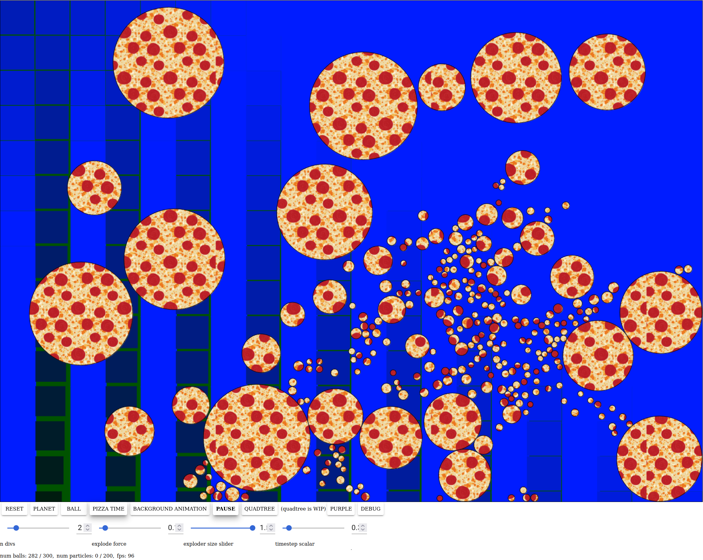

This was just a random experiment to play with javascript and canvas.
Click on the black background area some for action. Wait a bit and the colliding balls will explode and subdivide. :pizza:



It is hosted at:
http://allan.pizza

This repo also hosts a deployment of the golang-wasm implementation, which can be accessed at:
http://allan.pizza/go
(and the source can be found at https://github.com/aortez/pizza-pizza)

## Build it
```
gulp
```

## Run it locally
```
http-server
```