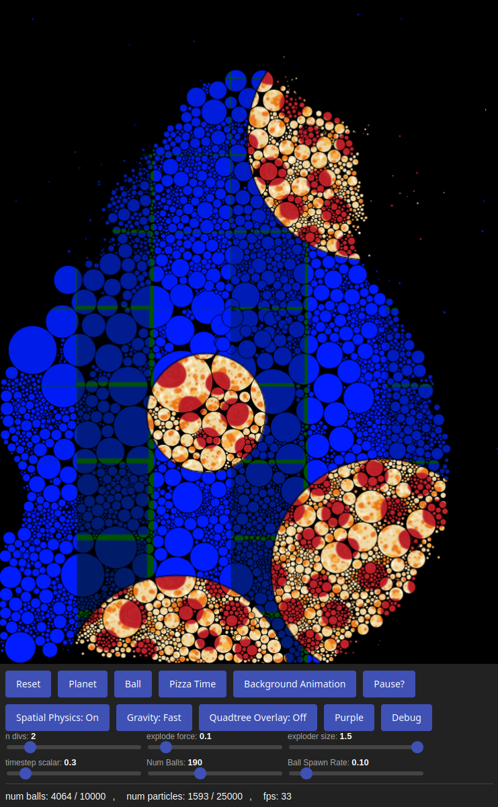

This is a small art piece application.  It implements a 2d world/physics engine.

Click on the black background area some for action. Wait a bit and the colliding balls will explode and subdivide. :pizza:



It is hosted at:
http://allan.pizza

This repo also hosts a deployment of the golang-wasm implementation, which can be accessed at:
http://allan.pizza/go
(and the source can be found at https://github.com/aortez/pizza-pizza)

## Development

Start the development server with hot reload:

```bash
npm run dev
```

WebGL2 is selected automatically when the browser supports it. The app falls
back to Canvas2D if WebGL2 cannot start, and the Renderer button switches
between the two implementations. Both renderers support the animated
background, pizza texture, purple mode, debug drawing, and quadtree overlay.
To force the reference renderer while comparing behavior, open:

```text
http://localhost:5173/?renderer=canvas2d
```

## Build for production

```bash
npm run build
```

## Preview production build

```bash
npm run preview
```
